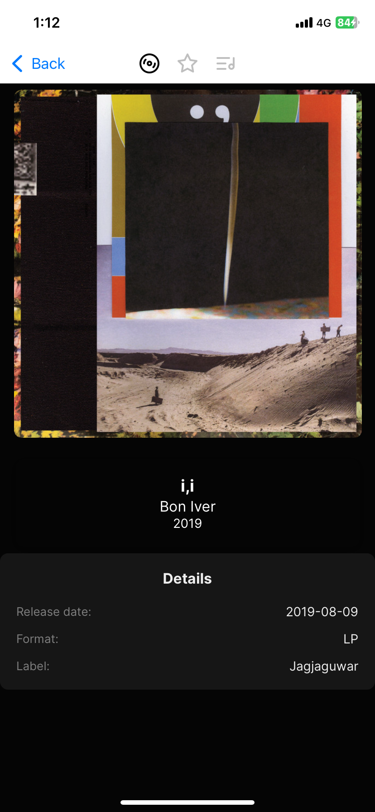
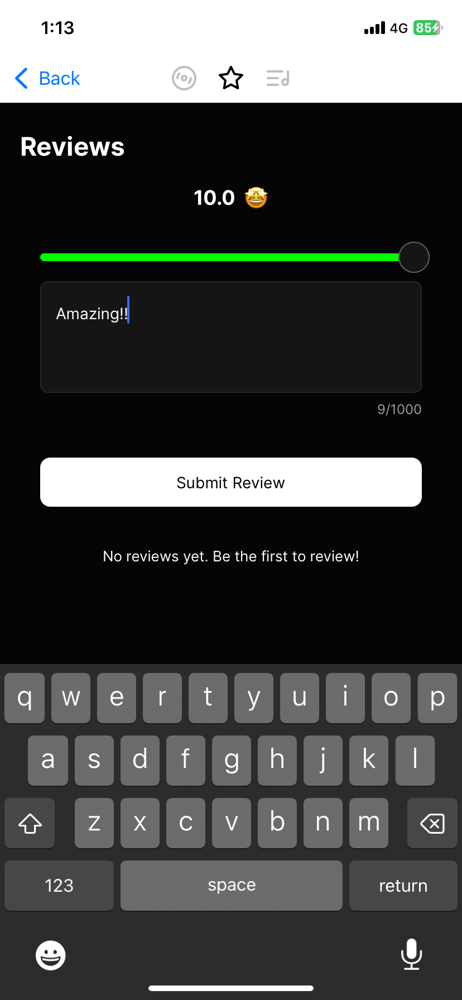
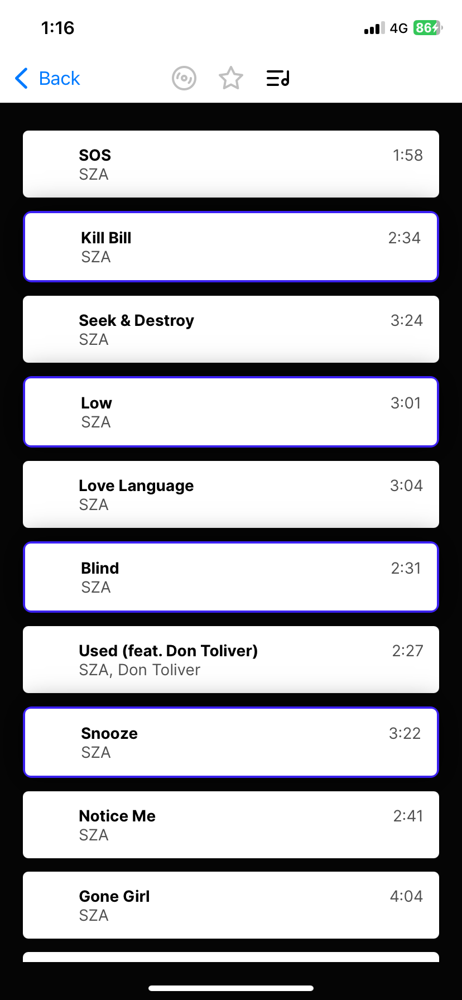
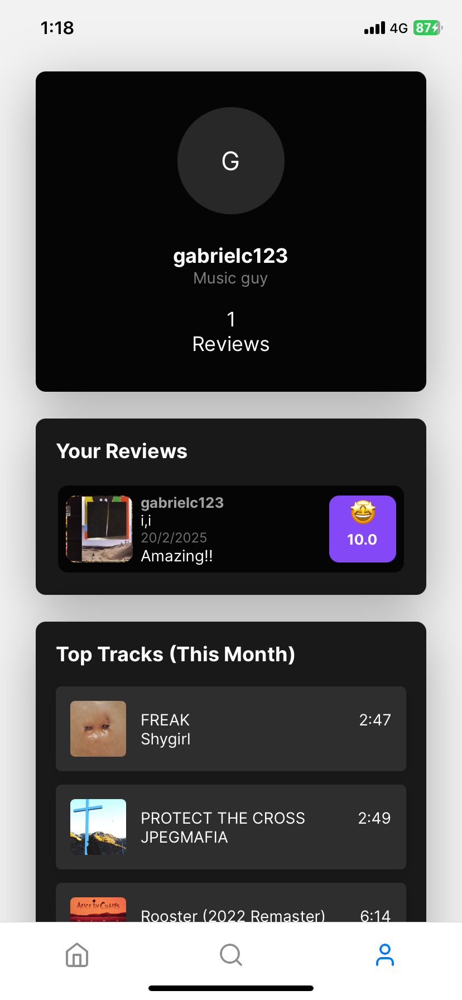
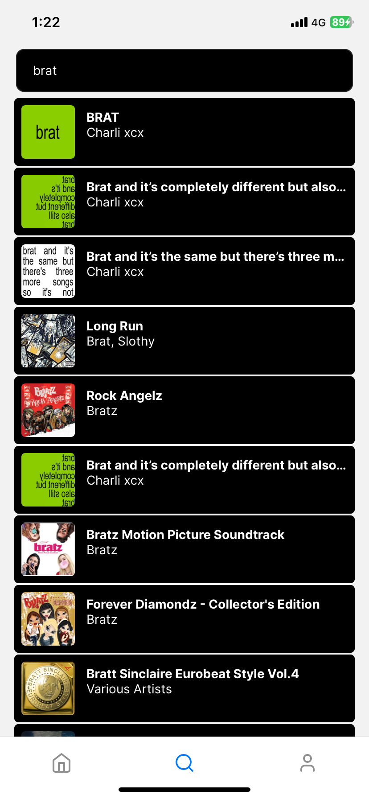
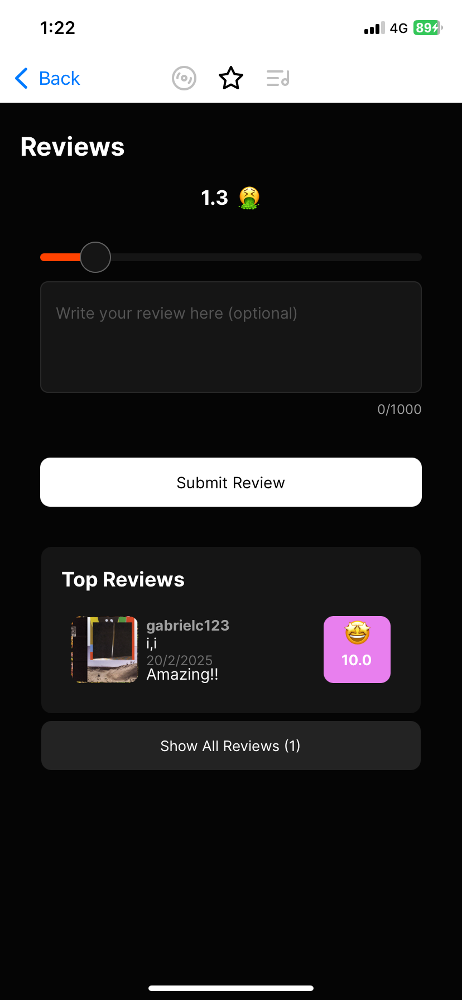
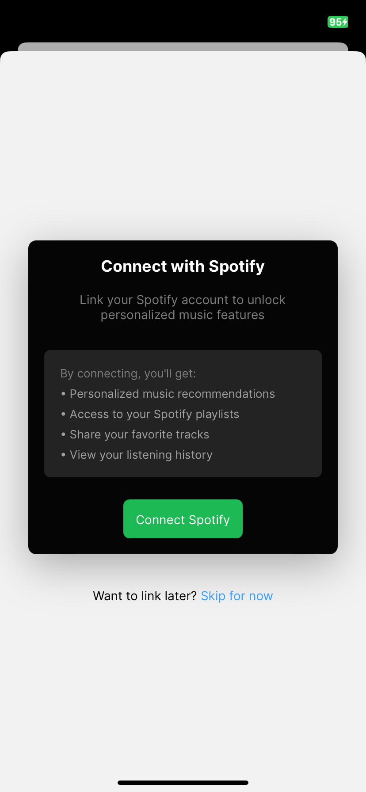

# Untitled Music App

## Description

Eclectic taste in music? Need to show your friends you liked an artist before they were cool? This platform aims transforms your music taste into a shareable profile that to captures your entire musical identity!  

## Features

- [x] Registration/authentication
- [x] Album and artist search
- [x] Ability to rate and review albums
- [x] Share your thoughts through detailed reviews
- [x] Explore trending songs on your favourite albums
- [x] Link your Spotify account to display top songs on your profile page

## To Do

- [ ] Add song review feature
- [ ] Add artist review feature
- [ ] Add shareable Instagram stories feature
- [ ] Make styling consistent (in progress)
- [ ] Optimise web app
- [ ] Add Like/comment features on individual reviews

## Screenshots

## Installation

1. Clone the repository to your local machine.
2. Rename .env.example to .env and fill in your Spotify Developer API credentials, and fill 'PROXY_SERVER' as the IP of the device running the proxy (if on the same device, localhost works).
3. Open a terminal window and run 'node proxy.js' to start the development server.
4. Navigate to the music-app directory and run `npx expo start`.
6. To test on your mobile device:
  - Download the Expo Go app from your device's app store
  - Ensure your phone is on the same network as your computer
  - Scan the QR code from your terminal with Expo Go
  - The app will load on your device for testing
